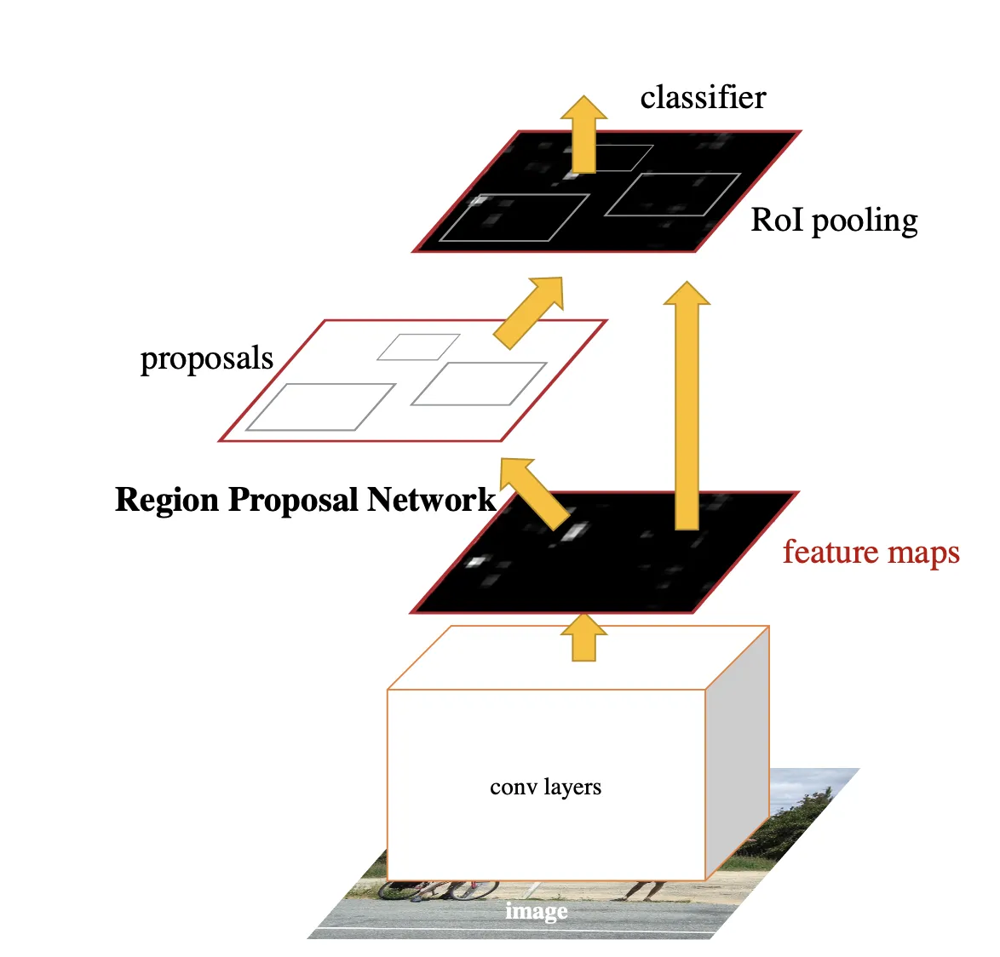
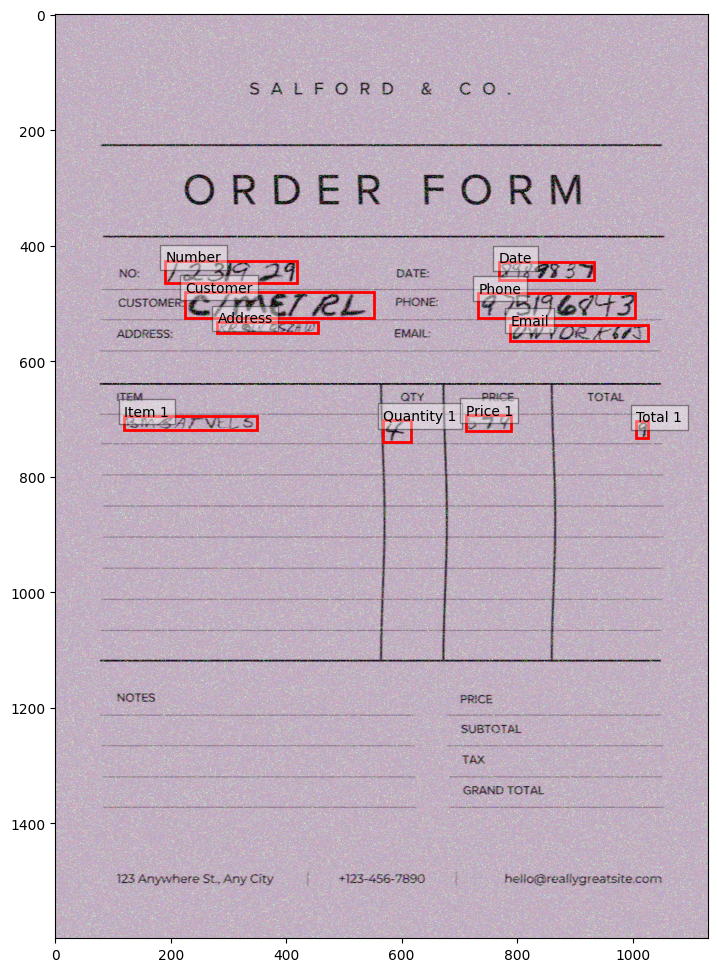
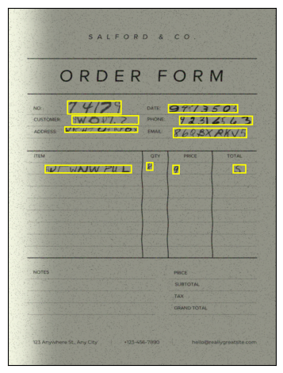

# Text Detector Model

This model is based on Faster RCNN

## Model Architecture
Faster RCNN is an object detection model based using an architecture with different parts as shown in the image:


- <b>Backbone</b> is usually a pre-trained an image classification model used to learn image feature, in our case we used mobilenet_v3 that is ligthweight compared to other backbones.
- <b>Region Proposal Network</b> this part of the network is responsible of selecting regions with possible content that will go then in the next part of the network
- <b>Fully Connected Layers</b> this last part classify the region and outputs the score for each class and the bounding box coordinates, the output is replaced in our case to reflect the classes that we have for fine tuning


## Input
The model receives as input an image of a document like and the bounding boxes containing relevant text and the class of each one


## Output
The model outputs the predicted boxes with the predicted class and a score



## Training
For the training you can use the [TextDetectorModel](../../notebooks/TextDetectorModel.ipynb) notebook

in the firs part of the notebook you can specify parameters like:
- `documents_dir`, path to the folder containing data, both images and annotatrions
- `num_epochs`, number of epochs to use for training
- `MLFlow tracking url`, url of MLFlow server for model tracking
- `batch_size`, batch size for training
- `device`, to use for training

## Deploy

```bash
cd ./src/text_detector_model/api
export MLFLOW_RUN_ID=<run_id>
export MLFLOW_MODEL_NAME=<model_name>
python app.py
```

Using Docker (Not working yet)
```bash
cd ./src/text_detector_model/api
docker build -t text-detector-model-api .
docker run -p 5001:5001 -e MLFLOW_RUN_ID=<run_id> -e MLFLOW_MODEL_NAME=<model_name> text-detector-model-api
```